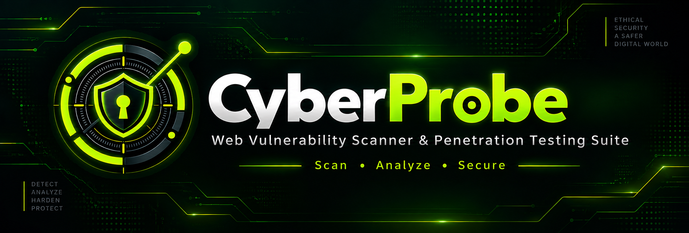
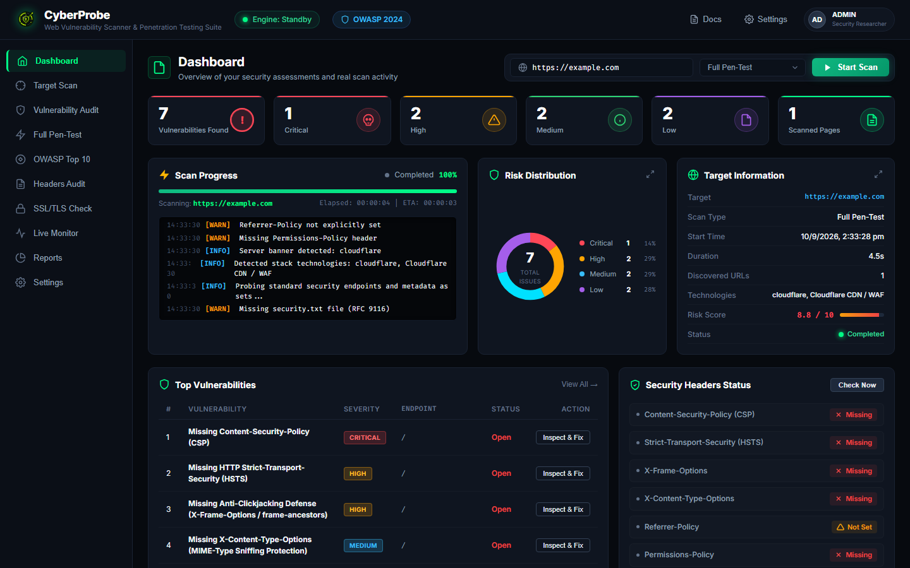
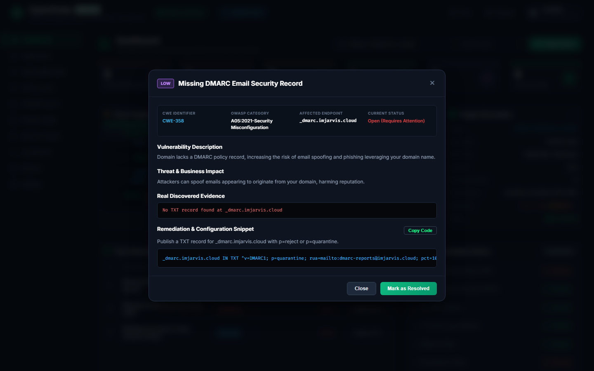
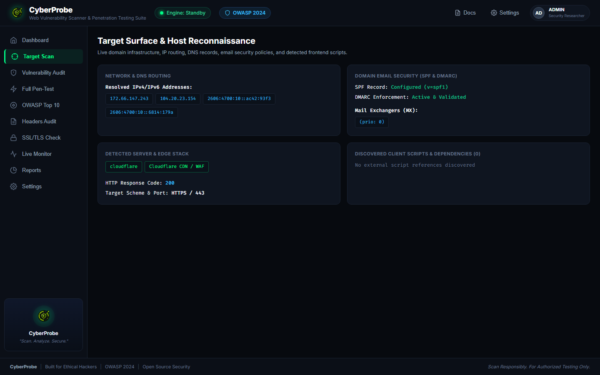
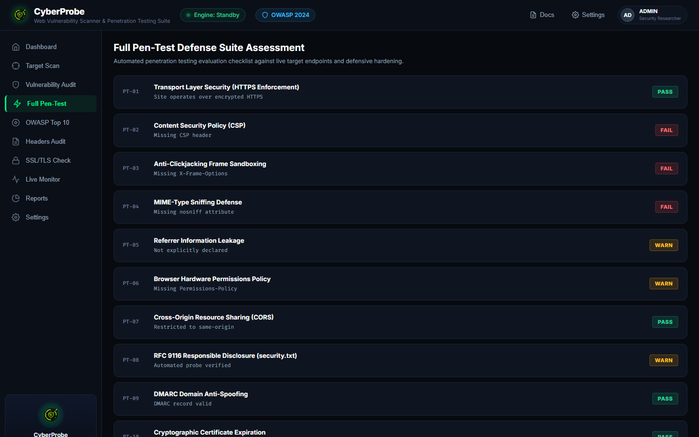
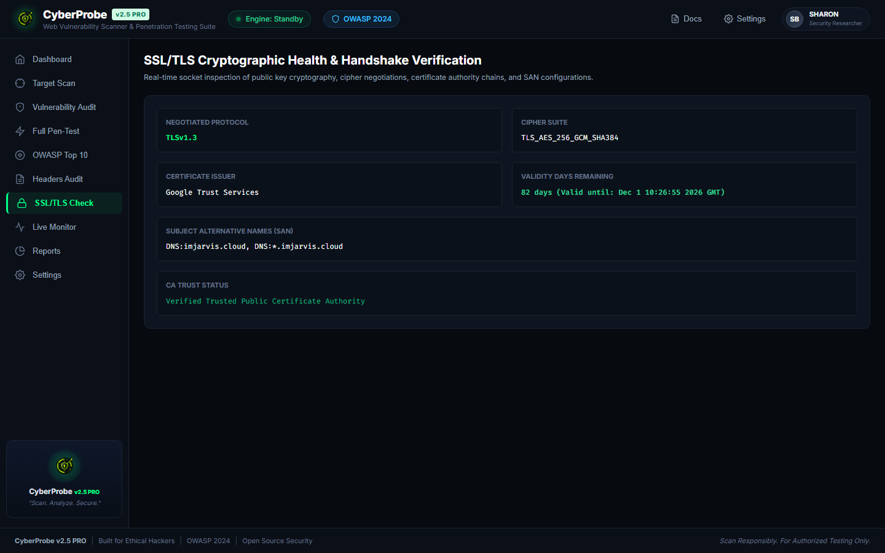
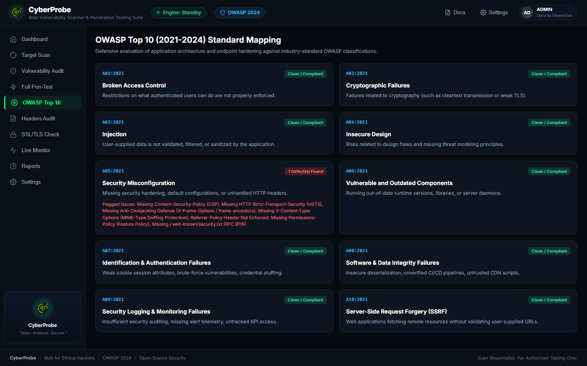

<div align="center">


# 🛡️ CyberProbe

### Web Vulnerability Scanner & Penetration Testing Suite
**Real Network Scanning Engine • Zero Mock Data • OWASP 2024 Defensive Compliance**

<br/>




```text
 ██████╗ ██╗  ██╗███████╗██╗  ██╗ █████╗ ██████╗  ██████╗ ███╗   ██╗
██╔═████╗╚██╗██╔╝██╔════╝██║  ██║██╔══██╗██╔══██╗██╔═══██╗████╗  ██║
██║██╔██║ ╚███╔╝ ███████╗███████║███████║██████╔╝██║   ██║██╔██╗ ██║
████╔╝██║ ██╔██╗ ╚════██║██╔══██║██╔══██║██╔══██╗██║   ██║██║╚██╗██║
╚██████╔╝██╔╝ ██╗███████║██║  ██║██║  ██║██║  ██║╚██████╔╝██║ ╚████║
 ╚═════╝ ╚═╝  ╚═╝╚══════╝╚═╝  ╚═╝╚═╝  ╚═╝╚═╝  ╚═╝ ╚═════╝ ╚═╝  ╚═══╝

                     0x S H A R O N
                 // SECURITY RESEARCHER //
```

[](https://nodejs.org/)
[](https://expressjs.com/)
[](https://owasp.org/)
[](http://localhost:3000)
[](LICENSE)

</div>

---

## 📌 Overview

**CyberProbe** is an enterprise-grade, defensive web security auditor, vulnerability scanner, and penetration testing suite built for cybersecurity engineers, devops teams, and ethical researchers.

Unlike mock demonstration tools, **CyberProbe runs 100% real defensive security audits against live targets**:
* **Real Network TLS Handshakes**: Connects directly via raw TLS sockets on port 443 to inspect cipher negotiation, protocol versions, CA root chains, expiration dates, and SAN extensions.
* **Real HTTP Response Inspection**: Evaluates live target headers against modern security specifications (CSP, HSTS, X-Frame-Options, X-Content-Type-Options, Referrer-Policy, Permissions-Policy, CORS).
* **Live DNS & Host Reconnaissance**: Resolves real IPv4/IPv6 records, queries MX mail exchangers, and audits TXT records for SPF and DMARC enforcement.
* **Server-Sent Events (SSE) Live Terminal**: Streams real-time, color-coded scan telemetry (`[INFO]`, `[WARN]`, `[CRIT]`, `[PASS]`) directly into a cyber-themed console.
* **Actionable "Inspect & Fix" Remediation**: Provides concrete, copy-paste server configuration snippets (Nginx, Apache, Node.js/Express, Cloudflare) for every discovered vulnerability.

---

## 📸 Live Visual Demo

### 1. Main Security Dashboard
The command center displays live metric counters (Total, Critical, High, Medium, Low), a dynamic SVG risk distribution donut chart, live terminal output, target information, and real-time security header statuses.



---

### 2. "Inspect & Fix" Remediation Modal
Clicking **Inspect & Fix** on any finding opens an in-depth security inspection modal detailing the vulnerability classification, CWE identifier, OWASP category, exact endpoint, real discovered evidence, and copy-paste remediation configurations.



---

### 3. Target Surface & Host Reconnaissance
Real-time DNS records, IPv4/IPv6 address resolution, SPF and DMARC email spoofing policies, detected reverse proxies (Cloudflare, AWS), and extracted client-side script dependencies.



---

### 4. Full Penetration Test Defense Assessment Checklist
An automated 10-point penetration testing defense checklist evaluating transport encryption, clickjacking sandboxes, MIME-sniffing, CORS cross-origin policies, and RFC 9116 `security.txt` files.



---

### 5. SSL/TLS Cryptographic Health Inspection
Performs an actual Node.js `tls.connect` socket handshake against port 443 of the target domain to inspect negotiated protocols (`TLSv1.3`), cipher suites (`TLS_AES_256_GCM_SHA384`), issuer CAs (`Google Trust Services`), expiration dates, and SAN extensions.



---

### 6. OWASP Top 10 (2021–2024) Standard Mapping
Discovered vulnerabilities are mapped to official OWASP categories (such as A05:2021 Security Misconfiguration or A02:2021 Cryptographic Failures) with automated compliance tagging.



---

## ⚡ Key Features

| Capability | Defensive Audit Detail |
| :--- | :--- |
| **HTTP Security Headers** | Probes `Content-Security-Policy`, `Strict-Transport-Security`, `X-Frame-Options`, `X-Content-Type-Options`, `Referrer-Policy`, `Permissions-Policy`, and `Access-Control-Allow-Origin`. |
| **SSL/TLS Handshake** | Raw socket inspection on port 443 capturing protocol versions, cipher suites, certificate authorities, validity days, and SAN domains. |
| **DNS & Anti-Spoofing** | Resolves IPv4 A and IPv6 AAAA records, MX exchangers, and validates SPF (`v=spf1`) and DMARC (`_dmarc.<host>`) TXT records. |
| **Live Log Streaming** | High-performance Server-Sent Events (SSE) streaming real-time timestamped scan events to the terminal console. |
| **Dynamic Risk Engine** | Calculates weighted CVSS-style risk scores (0.0 to 10.0 scale) based on discovered severity distributions. |
| **Inspect & Fix** | Executive summaries, threat impact assessments, exact server headers, and copyable server hardening snippets. |
| **Report Generation** | Export complete scan results to machine-readable JSON or generate printable executive PDF audit reports. |

---

## 🚀 Quick Start

### Prerequisites
* **Node.js** v18.0.0 or higher
* **npm** v9.0.0 or higher

### 1. Installation
Clone the repository and install the dependencies:
```bash
git clone https://github.com/your-username/CyberProbe.git
cd CyberProbe
npm install
```

### 2. Start the Server
Start the high-performance scanning server:
```bash
npm start
```
The server will initialize on:
```text
====================================================

 ██████╗ ██╗  ██╗███████╗██╗  ██╗ █████╗ ██████╗  ██████╗ ███╗   ██╗
██╔═████╗╚██╗██╔╝██╔════╝██║  ██║██╔══██╗██╔══██╗██╔═══██╗████╗  ██║
██║██╔██║ ╚███╔╝ ███████╗███████║███████║██████╔╝██║   ██║██╔██╗ ██║
████╔╝██║ ██╔██╗ ╚════██║██╔══██║██╔══██║██╔══██╗██║   ██║██║╚██╗██║
╚██████╔╝██╔╝ ██╗███████║██║  ██║██║  ██║██║  ██║╚██████╔╝██║ ╚████║
 ╚═════╝ ╚═╝  ╚═╝╚══════╝╚═╝  ╚═╝╚═╝  ╚═╝╚═╝  ╚═╝ ╚═════╝ ╚═╝  ╚═══╝

                     0x S H A R O N
                 // SECURITY RESEARCHER //

====================================================
🛡️  CYBERPROBE - Security Engine Online
📡 Server running at http://localhost:3000
🎯 Real Web Vulnerability & Penetration Suite Ready
⚡ 0xSHARON // INITIALIZING SECURITY PROTOCOLS...
====================================================
```

### 3. Open the Dashboard
Open your browser and navigate to:
```
http://localhost:3000
```
Enter any public target URL (e.g. `https://example.com`, `https://wikipedia.org`, `https://github.com`, or your own domain) and click **Start Scan**.

---

## 📡 REST & Streaming API Reference

CyberProbe provides a clean API for automation and CI/CD pipelines:

### 1. Execute Security Scan
`POST /api/scan`

**Request Body:**
```json
{
  "targetUrl": "https://example.com",
  "scanProfile": "Full Pen-Test"
}
```

**Response (200 OK):**
```json
{
  "success": true,
  "targetInfo": {
    "targetUrl": "https://example.com",
    "hostname": "example.com",
    "scanType": "Full Pen-Test",
    "duration": "2.4s",
    "riskScore": 8.8,
    "status": "Completed"
  },
  "counts": {
    "Critical": 1,
    "High": 2,
    "Medium": 2,
    "Low": 2,
    "Total": 7
  },
  "securityHeaders": {
    "Content-Security-Policy": { "status": "Missing" },
    "Strict-Transport-Security": { "status": "Missing" }
  },
  "vulnerabilities": [ ... ]
}
```

### 2. Real-Time Telemetry Stream (SSE)
`GET /api/scan-stream?url=https://example.com&profile=Full%20Pen-Test`

Streams live Server-Sent Events (`log`, `status`, `complete`, `error`) as the target is scanned.

### 3. Engine Health & Standards
`GET /api/status`

Returns active scanner engine version, operational status, and supported compliance standards (OWASP 2024, CWE, NIST SP 800-115).

---

## 📂 Project Architecture

```text
CyberProbe/
├── public/                       # Frontend Web Application
│   ├── index.html                # Semantic cybersecurity dashboard
│   ├── app.css                   # Dark cybersecurity design system
│   ├── app.js                    # Client-side state, SSE receiver & tabs
│   └── logo.png                  # Official CyberProbe emblem
├── screenshots/                  # High-resolution documentation screenshots
│   ├── cyberprobe_dashboard_completed.png
│   ├── cyberprobe_inspect_modal.png
│   ├── cyberprobe_target_recon_tab.png
│   ├── cyberprobe_pentest_tab.png
│   ├── cyberprobe_tls_tab.png
│   └── cyberprobe_owasp_tab.png
├── scanner.js                    # Core real defensive network scanning engine
├── server.js                     # Express backend & SSE streaming API
├── package.json                  # Dependencies & scripts
└── README.md                     # Comprehensive project documentation
```

---

## ⚖️ Ethical Testing & Disclaimer

> [!IMPORTANT]
> **CyberProbe is built for authorized, defensive security assessments and ethical vulnerability auditing.**
> 
> All audits executed by this suite are **non-invasive, passive, and RFC-compliant** (HTTP header analysis, socket handshakes, DNS records, and metadata discovery). Always obtain proper authorization before assessing third-party systems.

---

## 📄 License

This project is licensed under the **MIT License** — see the [LICENSE](LICENSE) file for details.
